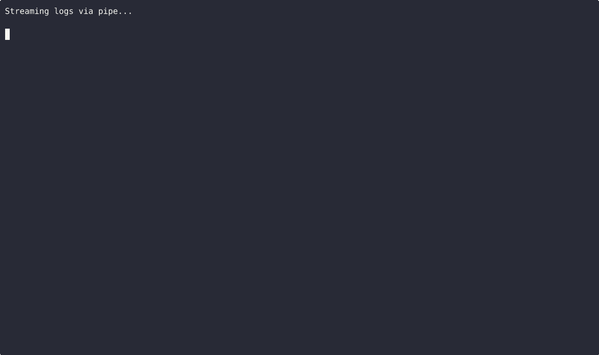

# LogPilot 🪵

[](https://github.com/clarabennett2626/logpilot/actions/workflows/ci.yml)
[](https://github.com/clarabennett2626/logpilot/releases/latest)
[](https://goreportcard.com/report/github.com/clarabennett2626/logpilot)
[](https://pkg.go.dev/github.com/clarabennett2626/logpilot)
[](LICENSE)

**A multi-source structured log viewer for the terminal.** Tail files, pipe from Docker/kubectl, mix JSON and logfmt and plain text — all in one interactive TUI.

<p align="center">
  
</p>

## Why LogPilot?

- **Structured-first.** LogPilot *parses* your logs — JSON fields, logfmt pairs, timestamps, levels — not just regex-highlights keywords. That means real filtering, not cosmetic coloring.
- **Format-agnostic.** Auto-detects JSON, logfmt, and plain text. Tail a JSON API log and a plain syslog side by side in one view. No config files, no format declarations.
- **Interactive, not passive.** Live-scrolling TUI with search, vim keybindings, and color-coded levels. Not a pager you pipe through — a tool you work *in*.
- **Lightweight and modern.** Single binary, no runtime dependencies. Built with Go and [Bubble Tea](https://github.com/charmbracelet/bubbletea) — starts instantly, stays under 20 MB RSS.

## Features

### Implemented

- 🔍 **Auto-format detection** — JSON, logfmt, plain text, no config needed
- 🎨 **Color-coded log levels** — DEBUG (gray), INFO (blue), WARN (yellow), ERROR (red), FATAL (red bold)
- 📂 **Multi-source input** — files, stdin/pipes, glob patterns (`*.log`)
- 🔄 **Live tailing** — follows files with rotation handling (rename, truncate)
- ⏱️ **Flexible timestamps** — relative (`2s ago`), ISO 8601, local time
- 🌗 **Dark & light themes** — auto-detects terminal background
- ⌨️ **Vim-style navigation** — `j/k`, `G`, `gg`, `/` search, `n/N`
- 🚦 **Backpressure handling** — configurable: block or drop-oldest when buffer is full

### Roadmap

- ☸️ Kubernetes pod log source
- 🐳 Docker container log source
- 🔐 SSH remote log source
- 🏷️ Field-based filtering (`level:error service:auth`)
- 🔗 Trace correlation (group by trace ID)
- 📊 Timeline visualization

## Quick Start

```bash
# View a log file
logpilot app.log

# Tail with live follow
logpilot -f /var/log/app/*.log

# Pipe from Docker
docker logs -f my-container 2>&1 | logpilot -

# Pipe from kubectl
kubectl logs -f deploy/api-server | logpilot -

# Mix multiple sources with glob
logpilot services/*.log /var/log/syslog
```

## Installation

### Go install (requires Go 1.22+)

```bash
go install github.com/clarabennett2626/logpilot@latest
```

### Binary download

Grab a prebuilt binary from [Releases](https://github.com/clarabennett2626/logpilot/releases/latest):

```bash
# Linux (amd64)
curl -LO https://github.com/clarabennett2626/logpilot/releases/download/v0.1.0/logpilot_linux_amd64.tar.gz
tar xzf logpilot_linux_amd64.tar.gz
sudo mv logpilot /usr/local/bin/

# macOS (Apple Silicon)
curl -LO https://github.com/clarabennett2626/logpilot/releases/download/v0.1.0/logpilot_darwin_arm64.tar.gz
tar xzf logpilot_darwin_arm64.tar.gz
sudo mv logpilot /usr/local/bin/

# Windows (amd64)
# Download logpilot_windows_amd64.zip from the releases page and add to PATH
```

### From source

```bash
git clone https://github.com/clarabennett2626/logpilot.git
cd logpilot
go build -o logpilot ./cmd/logpilot
```

## Supported Formats

LogPilot auto-detects the format of each log line independently — you can mix formats in the same stream.

### JSON

```json
{"timestamp":"2026-02-19T12:00:01Z","level":"info","msg":"request handled","method":"GET","path":"/api/users","duration_ms":42}
{"timestamp":"2026-02-19T12:00:02Z","level":"error","msg":"connection refused","host":"db-primary","port":5432}
```

<details><summary>See demo</summary>

</details>

### logfmt

```
ts=2026-02-19T12:00:01Z level=info msg="request handled" method=GET path=/api/users duration_ms=42
ts=2026-02-19T12:00:02Z level=warn msg="slow query" query="SELECT *" duration_ms=1250
```

<details><summary>See demo</summary>

</details>

### Plain text

```
Feb 19 12:00:01 myhost sshd[1234]: Accepted publickey for deploy
Feb 19 12:00:02 myhost nginx: 192.168.1.1 - GET /health 200
```

<details><summary>See demo</summary>

</details>

### Piped input

```bash
kubectl logs -f deploy/api | logpilot -
```

<details><summary>See demo</summary>

</details>

## Keybindings

| Key | Action |
|---|---|
| `j` / `↓` | Scroll down |
| `k` / `↑` | Scroll up |
| `G` | Jump to bottom (latest) |
| `g g` | Jump to top |
| `f` / `Page Down` | Page down |
| `b` / `Page Up` | Page up |
| `/` | Start search |
| `n` | Next search match |
| `N` | Previous search match |
| `t` | Toggle timestamp format |
| `w` | Toggle line wrap |
| `Tab` | Cycle theme |
| `q` / `Ctrl+C` | Quit |

## Comparison

| | LogPilot | lnav | hl | tailspin | lazyjournal |
|---|:---:|:---:|:---:|:---:|:---:|
| **Interactive TUI** | ✅ | ✅ | ❌ | ❌ | ✅ |
| **Structured parsing** | ✅ | ✅ | ❌ | ❌ | Partial |
| **Multi-source** | ✅ | ✅ | ✅ | ✅ | ✅ |
| **Format-agnostic** | ✅ | Partial¹ | ✅ | ✅ | ❌² |
| **Language** | Go | C++ | Rust | Rust | Go |
| **Focus** | Structured log TUI | Log file navigator | Log processor/pager | Highlight & tail | journald/docker/k8s |

¹ lnav supports many formats but requires format definitions for custom structured logs.
² lazyjournal focuses on journald, Docker, and Kubernetes sources rather than arbitrary log files.

**Honest take:** lnav is the most mature and feature-rich tool here. tailspin and hl are excellent if you want fast, zero-config highlighting for piped output. lazyjournal is great if your logs come from systemd/Docker/k8s. LogPilot occupies the space between — an interactive TUI that understands structured fields across arbitrary log sources.

## Architecture

```
logpilot/
├── cmd/logpilot/       # CLI entrypoint
├── internal/
│   ├── app/            # Bubble Tea application model
│   ├── parser/         # Format detection + parsing (JSON, logfmt, plain)
│   ├── source/         # Input sources (file, stdin, glob)
│   ├── tail/           # File tailing with rotation handling
│   ├── theme/          # Dark/light theme definitions
│   ├── buffer/         # Ring buffer with backpressure
│   └── ui/             # Lipgloss view components
├── docs/demos/         # GIF demos
└── go.mod
```

## Development

```bash
# Build
go build ./cmd/logpilot

# Run tests
go test ./...

# Run tests with race detector
go test -race ./...

# Benchmarks
go test -bench=. ./internal/parser/

# Lint
golangci-lint run
```

## Contributing

Contributions are welcome! Whether it's a bug report, feature request, or pull request — all appreciated.

1. Fork the repo
2. Create a feature branch (`git checkout -b feat/my-feature`)
3. Commit with clear messages
4. Open a PR against `main`

Please open an issue first for large changes so we can discuss the approach.

## Acknowledgments

Built on the shoulders of the [Charm](https://charm.sh/) ecosystem:

- [Bubble Tea](https://github.com/charmbracelet/bubbletea) — TUI framework
- [Lipgloss](https://github.com/charmbracelet/lipgloss) — Styling
- [Bubbles](https://github.com/charmbracelet/bubbles) — TUI components

## License

[MIT](LICENSE)
